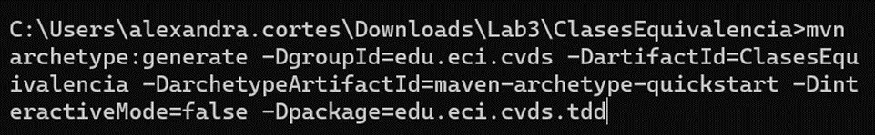
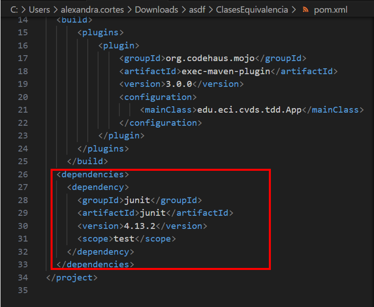
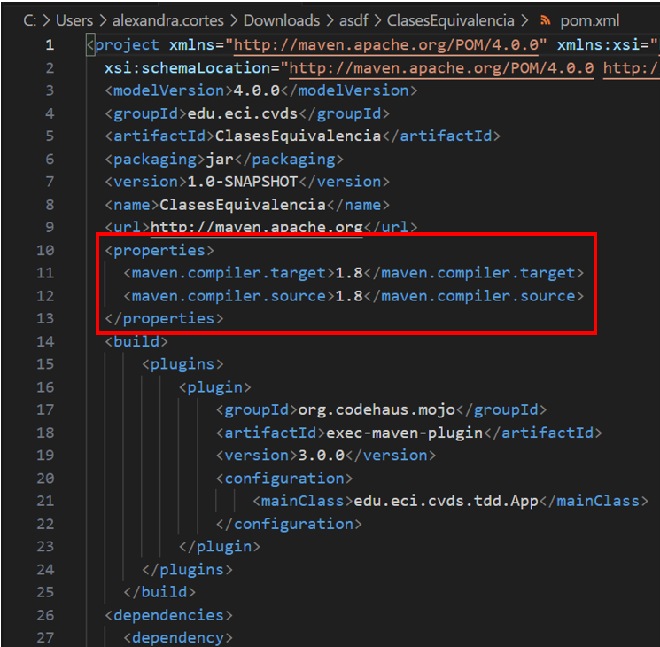
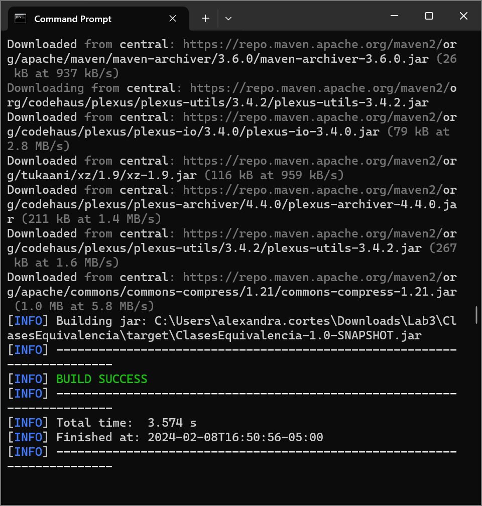
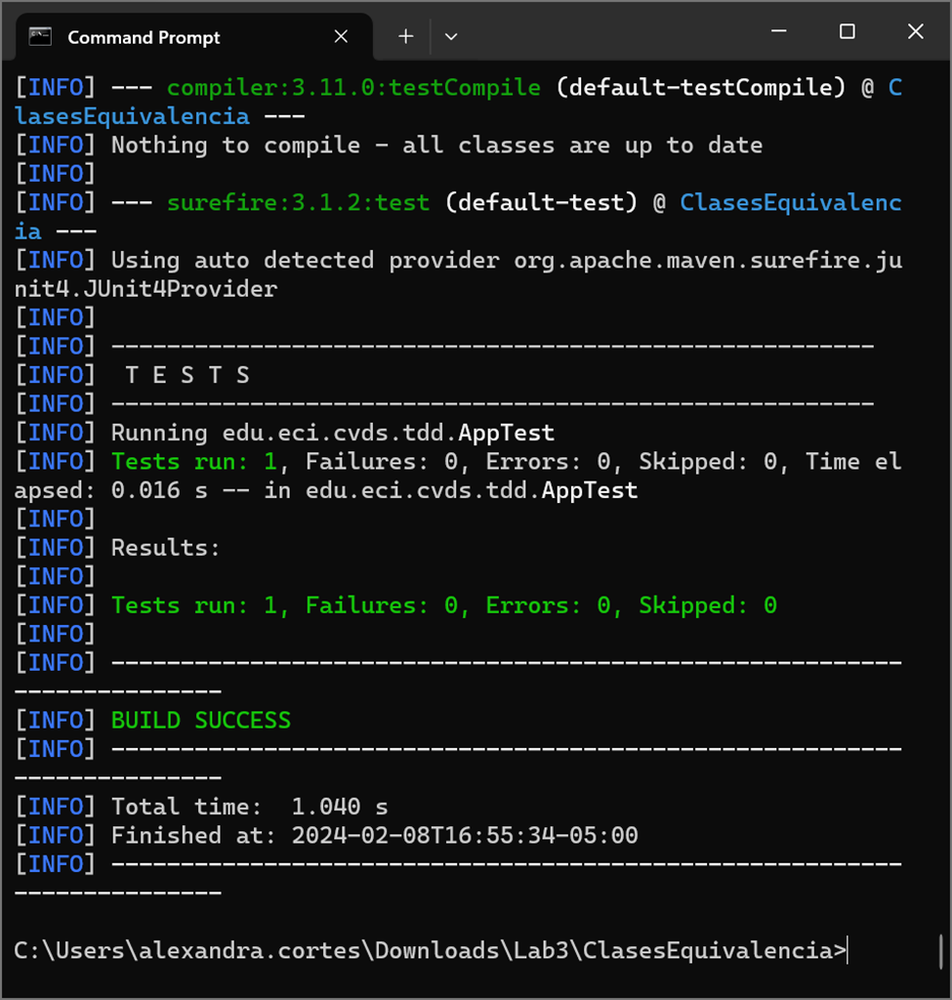
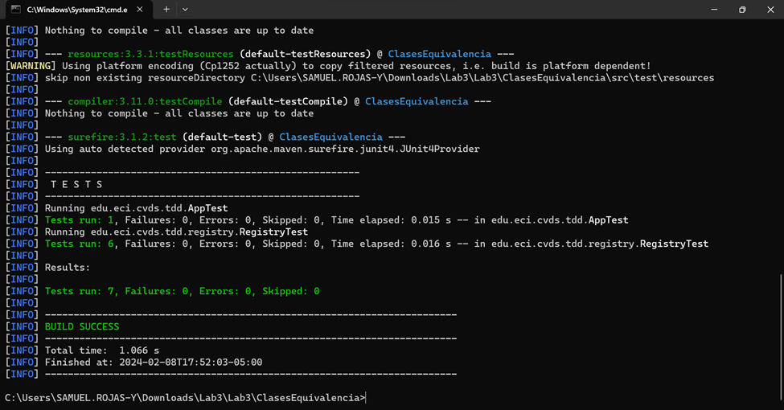
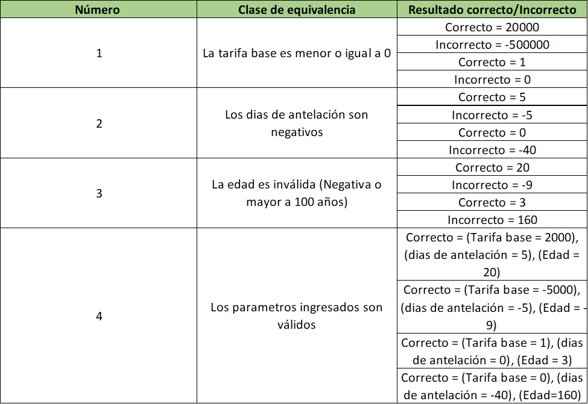
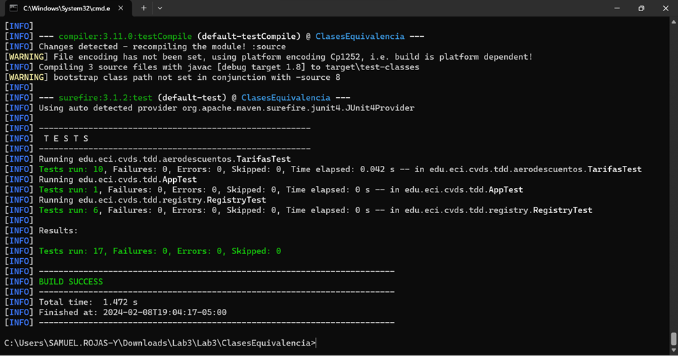

# Laboratorio 3 - CDD
En el ámbito del desarrollo de software, las pruebas son una fase crítica para garantizar la calidad del producto final. Entre las diversas técnicas y enfoques disponibles, las clases de equivalencia destacan como una metodología fundamental para diseñar casos de prueba efectivos y eficientes. 

Las clases de equivalencia nos permiten agrupar conjuntos de datos de entrada que deberían producir resultados similares en el sistema bajo prueba. Esta técnica se basa en la premisa de que si un caso de prueba funciona para un conjunto de datos representativos dentro de una clase de equivalencia, es probable que funcione para todos los datos en esa clase.

En este laboratorio se evidenciará la importancia de estas clases de equivalencia en el desarrollo de Software, a través de ejercicios prácticos.

## Crear un proyecto en Maven

Para crear el proyecto con arquetipos es necesario utilizar el comando 
```shell
mvn archetype:generate
```
En conjunto con los detalles del proyecto tales como groupId, artifactId, version, etc.




## Actualizar y crear dependencias
Para Agregar la dependencia obtenida del artefacto JUnit el repositorio de maven, se debe configurar el archivo pom.xml.


Consecuentemente se cambia la versión del compilador en el mismo archivo.



## Compilar y ejecutar
### Compilar
Para compilar el archivo es necesario utilizar el comando 
```shell
mvn package
```
Al finalizar se genera un mensaje informando que su construción fue exitosa.


### Ejecutar
Para ejecutar las pruebas se utiliza el comando
```shell
mvn test
```
Depués de ejecutar las pruebas se genera un informe de la cantidad de pruebas que fueron ejecutadas, cuantas de ellas fallaron y cuantas de ellas obtuvieron errores.



## Ejercicio "Registraduria"
Despues de la creación de las clases que ayudan a definir que votos son válidos o no, se procede a realizar pruebas de como deberia ser el comportamiento adecuado de estas clases, seccionandolos como casos de equivalencia. 

Para ello se determinó las siguientes situaciones:

1. Ingreso de una persona con edad válida (Entre 18 y 100 años)
2. Ingreso de una persona con un id duplicado.
3. Ingreso de una persona muerta.
4. Ingreso de una persona con edad menor a 18 años.
5. Ingreso de una persona con edad invalida (Negativa)
6. Ingreso de una persona con edad invalida (Edad mayor a 100 años)

Los resultados de ejecutar estas pruebas fueron exitosos.



## Ejercicio "Descuento de tárifas"
### Parámetros inválidos
Los casos en donde se deberia lanzar una excepción de parametros ingresados son invalidos son los siguientes:

* La tarifa base ingresada es menor o igual a 0
* Los dias de antelación son negativos
* La edad es inválida (Negativa o mayor a 100 años)

### Clases de equivalencias


### Fronteras
Las condiciones limite (fronteras) que se definieron para los parametros son las siguientes:

1. Tarifa base: Menor o igual a 0.
2. Dias de antelación: Menores a 0.
3. Edad: Menor a 0 o mayor a 100.

### Ejecución de pruebas
Se ejecutaron las pruebas correctamente.


## Construido con
* Java 21.0.1
* Maven 3.9.6
  
## Autores
* __Alexandra Cortes Tovar__
* __Samuel Rojas Yopasa__
* __Juan Sebastián Vásquez Vega__ 
